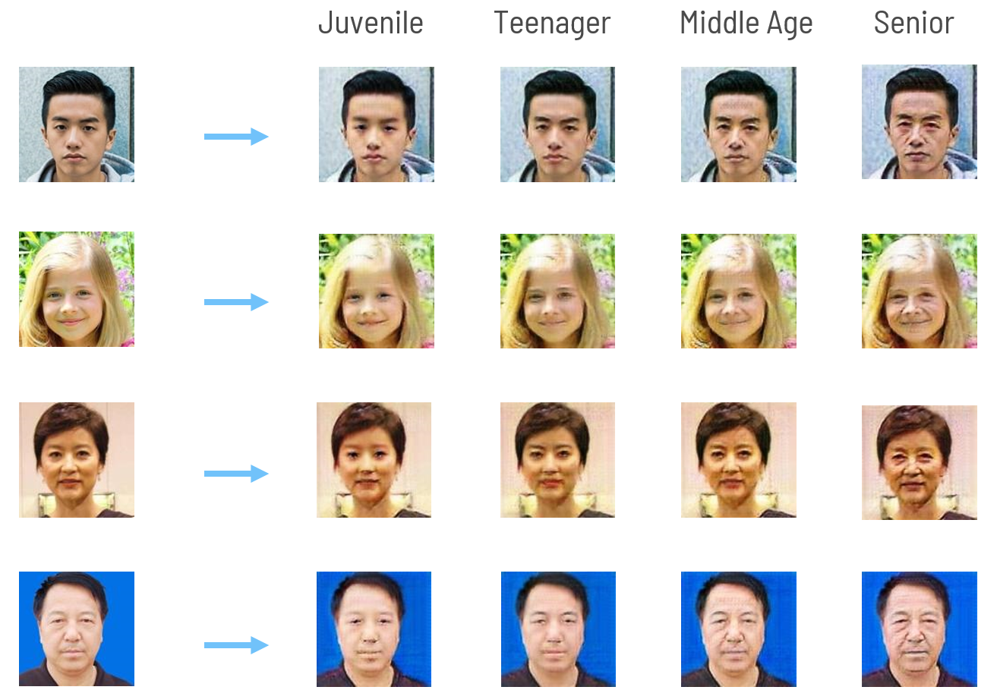
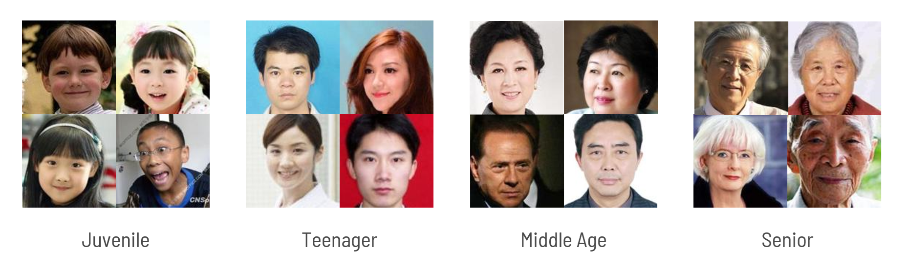

<!-- PROJECT LOGO -->
<br />
<div align="center">
  <h1 align="center">Face Aging Model Using StarGAN</h1>
</div>



<!-- ABOUT THE PROJECT -->
## About The Project

StarGAN emerges as a groundbreaking solution, addressing the shortcomings of previous methods. This deep learning model excels at image-to-image translation tasks. Unlike traditional approaches that necessitate a separate model for each aging transformation, StarGAN utilizes a single unified model.  By leveraging conditional GANs, StarGAN can generate realistic aged faces based on specific age labels. This versatility allows for diverse image translations without the need for domain-specific models.




<!-- GETTING STARTED -->
## Getting Started


### Installation

1. Clone the repo
   ```sh
   git clone https://github.com/trungmac07/Face_Aging.git
   ```
2. Install related packages
    ```sh
    pip install -r requirements.txt
    ```

### Download pretrained models
1. Link download models: https://drive.google.com/file/d/1vLKeYhW9kCceIcNySnga42MQYLV609Mn/view?usp=sharing

2. Extract the zip file into the project folder


<!-- USAGE EXAMPLES -->
## Usage

### Training


example:
```bash 
python.exe Main.py --chan_dim 4 --image_size 128 --num_steps 100000 --n_critic 5 --start_step 0 --mode train --image_dir AAF_4/train --log_dir train/logs --model_save_dir train/models --sample_dir train/samples  --log_step 10 --sample_step 1000 --model_save_step 1000
```
### Testing
example:
```bash 
python.exe Main.py --mode test --test_img_path test_img/man.jpg test_img/girl.jpg test_img/middleage.jpg test_img/woman.jpg --result_dir test_img/result --G_path model/G --D_path model/D
```


### Running on GUI
example:
```bash 
python.exe GUI.py
```


<!-- CONTACT -->
## Contact

Email:
- mttrung16@gmail.com
- quannguyen2153@gmail.com

Project Link: [https://github.com/trungmac07/Face_Aging](https://github.com/trungmac07/Face_Aging)

